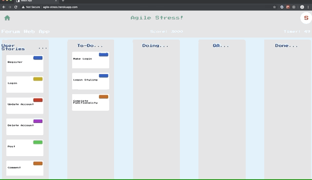
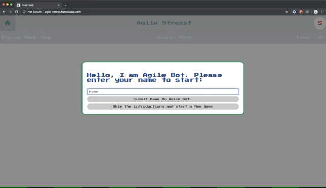
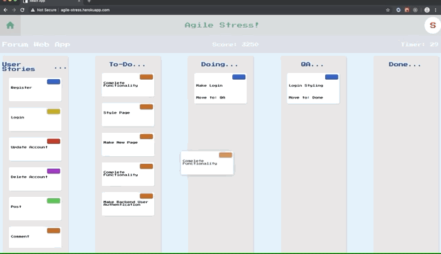
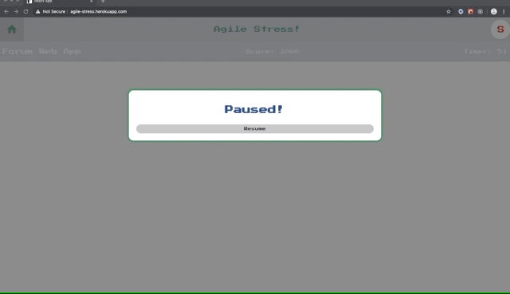
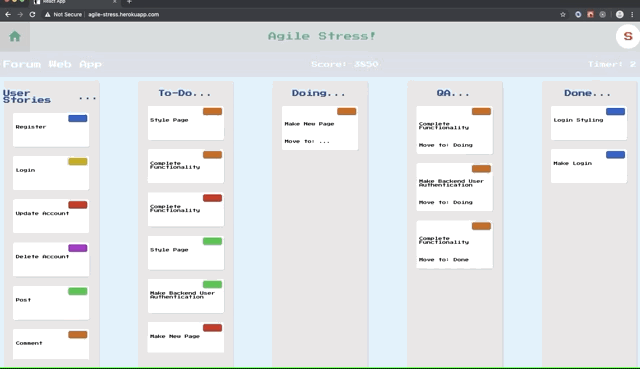

# Agile Stress

Live link: [agile-stress.herokuapp.com](agile-stress.herokuapp.com)

[Agile Stress](agile-stress.herokuapp.com) is an arcade game where you accumulate points for moving agile tickets to the appropriate columns under a certain amount of time.

## How to Play

Agile Bot will introduce itself and explain the rules.

You play by dragging and dropping tickets in to their appropriate places.

Feel free to pause the game at any time by clicking on the home symbol in the top left or the 'S' in the top right.

Try to beat your high score!

## Contributor(s)

Agile Stress was built by:

   - [Shaun Colley](https://github.com/shaunwcolley)

## Tools

Agile Stress was built using [React](https://github.com/facebook/create-react-app) Hooks and TypeScript.

Checkout the [custom declarative hook](https://overreacted.io/making-setinterval-declarative-with-react-hooks/) for using timeout and interval and why it is important to set them up as custom declarative hooks. If you do not use `React.useRef()` the various timeouts can be fired infinitely and interfer with other timers. Agile Stress utilized three different timings: the general game clock, how frequently a random task is added, and a timer for each ticket to tell you which column to move it to.
